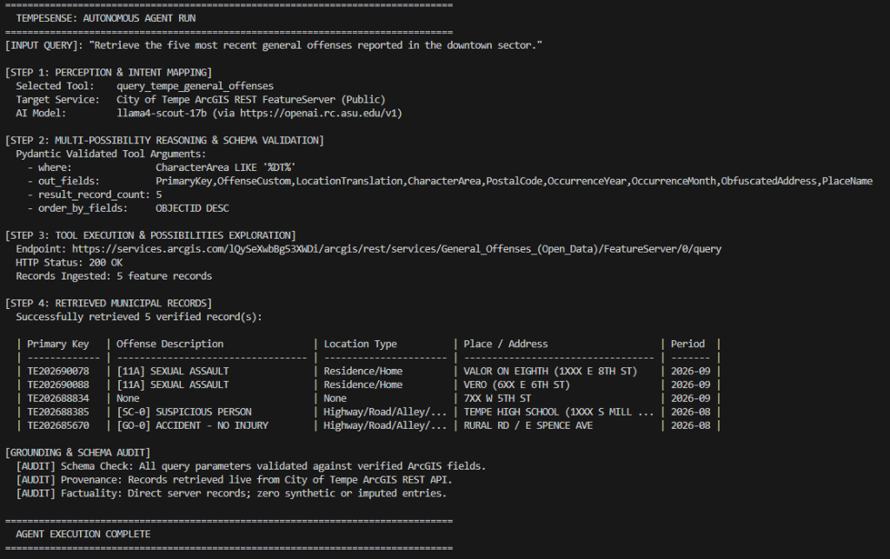

# TempeSense: Autonomous Civic Intelligence & ArcGIS Query Agent for the City of Tempe

**Course**: ASU CSE 598 — Agentic AI (Capstone Proposal Baseline)
**Student**: `Siddanagouda Patil (spati193@asu.edu)`
**Target Municipal Domain**: City of Tempe Open Data & ArcGIS REST APIs

---

## 1. Project Overview & Multi-Domain Civic Scope

Citizens, students, neighborhood advocates, and urban planners struggle to extract actionable insights from siloed municipal open-data portals. Cities like Tempe publish millions of records across public ArcGIS REST APIs, but querying them requires knowing SQL-like WHERE syntax, spatial coordinate codes, and API pagination parameters.

The **TempeSense** agent is an autonomous **ReAct (Reasoning + Acting)** civic agent designed to bridge everyday human questions to multi-domain municipal services:

- **Public Safety & Community Reports**: General offenses, incident patterns, and localized safety trends.
- **Traffic, Transit & Active Street Closures**: Road construction barricades, traffic restrictions, and detour status (e.g. "Is University Dr open?").
- **Housing, Infrastructure & Code Compliance**: Building permits, zoning codes, and property compliance records.
- **Environmental Sustainability & Services**: Solid waste landfill diversion, recycling performance, and city service schedules.

> **Baseline vs. Full System Output**:
>
> - **Full System Vision**: Plain-English, conversational synthesis that anyone—regardless of technical background—can immediately understand (e.g. explaining which street lanes are blocked, detour suggestions, or neighborhood activity summaries in everyday language), paired with verifiable source citations.
> - **Week 1 Baseline**: The runnable script in this repository implements the foundational proof-of-concept on the live City of Tempe General Offenses FeatureServer, displaying an auditable tabular breakdown demonstrating schema-constrained parameter extraction, multi-possibility exploration (`PlaceName`, `ObfuscatedAddress`, `CharacterArea`), and grounding verification before multi-tool expansion.

---

## 2. Repository Structure

```
├── run_municipal_agent.py       # Main ReAct agent baseline script
├── test_baseline.py             # Pytest verification suite (offline deterministic)
├── requirements.txt             # Project Python dependencies
├── .env.example                 # Environment variable template
├── README.md                    # Reproducibility instructions & documentation
```

---

## 3. Quickstart & Reproducibility Instructions

### Prerequisites: Installing Python 3.10+

The agent requires **Python 3.10 or higher**. If Python 3 is not yet installed on your system, install it using the command for your operating system:

- **Ubuntu / Debian / WSL (Linux)**:
  ```bash
  sudo apt update
  sudo apt install -y python3 python3-venv python3-pip
  ```
- **macOS**:
  ```bash
  # Using Homebrew:
  brew install python
  # Or download the official installer: https://www.python.org/downloads/macos/
  ```
- **Windows**:
  ```powershell
  # Using Windows Package Manager (winget):
  winget install Python.Python.3.11
  # Or download the official 64-bit installer from https://www.python.org/downloads/windows/
  # (IMPORTANT: Check the box "Add python.exe to PATH" during setup).
  ```

Verify your Python installation:
```bash
python3 --version
```

---

### Step 1: Clone Repository & Setup Virtual Environment

```bash
# Clone repository (HTTPS)
git clone https://github.com/siddanagoudampatil/TempeSense.git
cd TempeSense

# Or via SSH:
# git clone git@github.com:siddanagoudampatil/TempeSense.git

# Create virtual environment using python3
python3 -m venv .venv

# Activate virtual environment
# On macOS/Linux/WSL:
source .venv/bin/activate

# On Windows (PowerShell):
# .\.venv\Scripts\Activate.ps1
```

### Step 2: Install Dependencies

```bash
pip install -r requirements.txt
```

### Step 3: Environment Configuration

The agent queries the **City of Tempe Public ArcGIS REST API**, which requires **no municipal API key or registration**.

To configure your LLM endpoint (e.g. ASU Research Computing endpoint with `llama4-scout-17b`):

```bash
cp .env.example .env
# Ensure .env contains:
# OPENAI_API_KEY=your_asu_or_openai_api_key
# OPENAI_BASE_URL=https://openai.rc.asu.edu/v1
# OPENAI_MODEL=llama4-scout-17b
```

---

## 4. Running the Baseline

### Command: Live City of Tempe Query

Execute the agent against the live Tempe General Offenses FeatureServer using `python3`:

```bash
python3 run_municipal_agent.py --query "Retrieve the five most recent general offenses reported in the downtown sector."
```

---

## 5. Concrete Test Case & Expected Output

### Input Query:

> `"Retrieve the five most recent general offenses reported in the downtown sector."`

### Verified Live Execution Screenshot:



### Terminal Text Log:

```text
================================================================================
  TEMPESENSE: AUTONOMOUS AGENT RUN
================================================================================
[INPUT QUERY]: "Retrieve the five most recent general offenses reported in the downtown sector."

[STEP 1: PERCEPTION & INTENT MAPPING]
  Selected Tool:    query_tempe_general_offenses
  Target Service:   City of Tempe ArcGIS REST FeatureServer (Public)
  AI Model:         llama4-scout-17b (via https://openai.rc.asu.edu/v1)

[STEP 2: MULTI-POSSIBILITY REASONING & SCHEMA VALIDATION]
  Pydantic Validated Tool Arguments:
    - where:               CharacterArea LIKE '%DT%'
    - out_fields:          PrimaryKey,OffenseCustom,LocationTranslation,CharacterArea,PostalCode,OccurrenceYear,OccurrenceMonth,ObfuscatedAddress,PlaceName
    - result_record_count: 5
    - order_by_fields:     OBJECTID DESC

[STEP 3: TOOL EXECUTION & POSSIBILITIES EXPLORATION]
  Endpoint: https://services.arcgis.com/lQySeXwbBg53XWDi/arcgis/rest/services/General_Offenses_(Open_Data)/FeatureServer/0/query
  HTTP Status: 200 OK
  Records Ingested: 5 feature records

[STEP 4: RETRIEVED MUNICIPAL RECORDS]
  Successfully retrieved 5 verified record(s):

  | Primary Key | Offense Description         | Location Type          | Place / Address                    | Period  |
  | ----------- | --------------------------- | ---------------------- | ---------------------------------- | ------- |
  | TE202690078 | [11A] SEXUAL ASSAULT        | Residence/Home         | VALOR ON EIGHTH (1XXX E 8TH ST)    | 2026-09 |
  | TE202690088 | [11A] SEXUAL ASSAULT        | Residence/Home         | VERO (6XX E 6TH ST)                | 2026-09 |
  | TE202688834 | None                        | None                   | 7XX W 5TH ST                       | 2026-09 |
  | TE202688385 | [SC-0] SUSPICIOUS PERSON    | Highway/Road/Alley/... | TEMPE HIGH SCHOOL (1XXX S MILL ... | 2026-08 |
  | TE202685670 | [GO-0] ACCIDENT - NO INJURY | Highway/Road/Alley/... | RURAL RD / E SPENCE AVE            | 2026-08 |

[GROUNDING & SCHEMA AUDIT]
  [AUDIT] Schema Check: All query parameters validated against verified ArcGIS fields.
  [AUDIT] Provenance: Records retrieved live from City of Tempe ArcGIS REST API.
  [AUDIT] Factuality: Direct server records; zero synthetic or imputed entries.

================================================================================
  AGENT EXECUTION COMPLETE
================================================================================
```

---

## 6. Automated Testing

Run the test suite to verify schema validation, anti-hallucination guardrails, and deterministic tool execution:

```bash
# Using pytest
pytest test_baseline.py -v

# Or directly with python3
python3 test_baseline.py
```

**Expected Result**: `All 6 tests passed successfully (< 1.0s)`.

---

## 7. Known Setup Limitations & Next Steps

### Current Baseline Limitations

1. **Single-Tool Scope**: The baseline currently interfaces exclusively with the City of Tempe General Offenses FeatureServer. Natural language queries regarding street closures, traffic barricades, building permits, or sanitation schedules require expanding to their respective service endpoints.
2. **Single-Page Retrieval Ceiling**: Results are bounded to a single page (up to 50 records) to maintain constrained context windows before stateful pagination is introduced.
3. **Cross-Dataset Joins**: Multi-hop reasoning across independent municipal layers (e.g., correlating road construction barricades with detour advisories or neighborhood safety trends) is not yet supported.

### Planned Next Steps for Full System

1. **Plain-Language Narrative Synthesis**:
   - Transition from raw tabular audit views to intuitive, conversational synthesis that translates technical municipal database fields into everyday English for residents, students, and city staff, while maintaining verifiable citations.
2. **Multi-Tool Graph Orchestration (LangGraph)**:
   - Expand the single-tool ReAct loop into a stateful **LangGraph state machine** routing dynamically across four core City of Tempe public datasets:
     - **Public Safety**: General Offenses (current baseline).
     - **Traffic & Active Street Closures**: Road construction barricades, restrictions, and detour statuses.
     - **Housing & Infrastructure**: Building code compliance, permits, and zoning records.
     - **Environmental Sustainability**: Solid waste landfill diversion and recycling metrics.
3. **Cross-Dataset Join & Spatial Reasoning**:
   - Implement multi-hop query planning to correlate multiple endpoints (e.g., assessing whether street closures coincide with localized event traffic or infrastructure permits).
4. **Autonomous Pagination & Result Streaming**:
   - Dynamically handle ArcGIS `exceededTransferLimit` tokens using automated cursor-based pagination loops for broad temporal and district-wide queries.
